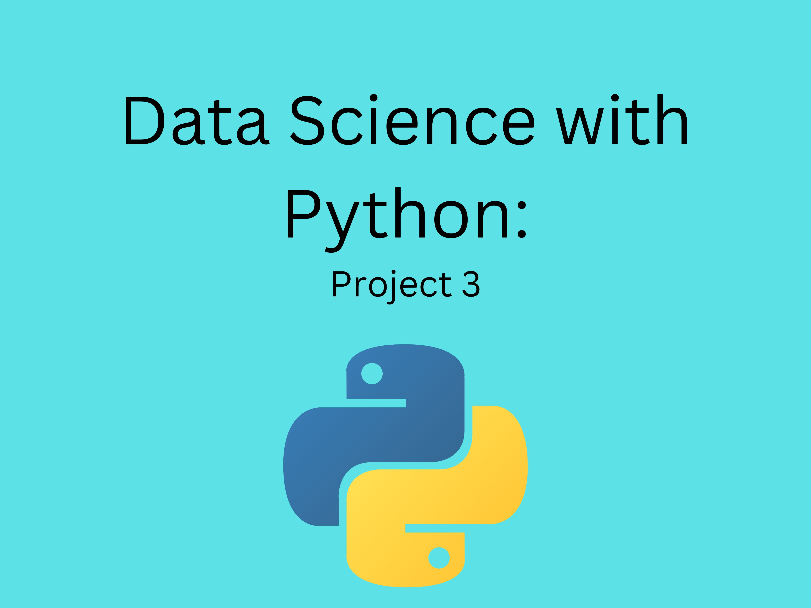

# Udacity programming for Data Science using Python

# Created by Pega Zarjam

This repository contains project 3 for Udacity Programming For Data Science Using Python.

## Date created
Sunday 27/11/2022.

## Project Title
Posting my work on GitHub for the Udacity Project 3

### Description
This  project is  to  utilise Git and Github to refactor Project2 and perform the requested tasks. 

## Python learning 

This course was titled data science programming with Python and included SQL, Python  and version cotrol (Github) materials too.

### Files used
BikeShare_project3.ipynb, Git-keyterms, ReadME.md 

### Credits
http://docs.github.com/en/get-started/quickstart/fork-a-repo

